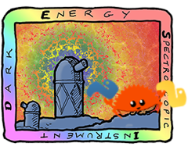

# RESI

### Dark Energy Rusty Instrument
Rust port of BAO likelihoods for DESI.



## to pip install
```bash
pip install maturin
# or
uv tool install maturin

# pip install to currently active venv
maturin develop --release
```

`quickstart.py` demonstrates how to use `resi` with `pypolychord`.

## c++ interface
At this point all of the functionality is in compiled languages, so no need for python.

```bash
cargo build --release

# copy the header and library to polychord
cp target/cxxbridge/resi/src/lib.rs.h /path/to/polychord/likelihoods/CC/
cp target/release/libresi.a /path/to/polychord/likelihoods/CC/

# build and run polychord
cd /path/to/polychord
make clean; make polychord_CC
./bin/polychord_CC
```

My `rust` branch of `polychord` already has the requisite changes to use this specific library.
However, it seems to require cleaning out all the previous compilation and starting afresh.

## run `main.rs`
```bash
cargo run --release
```

## run `examples/test_cpp.cpp`
```bash
cargo build --release
g++ -std=c++17 -I target/cxxbridge examples/test_cpp.cpp target/release/libresi.a -o test_likelihood
./test_likelihood
```
